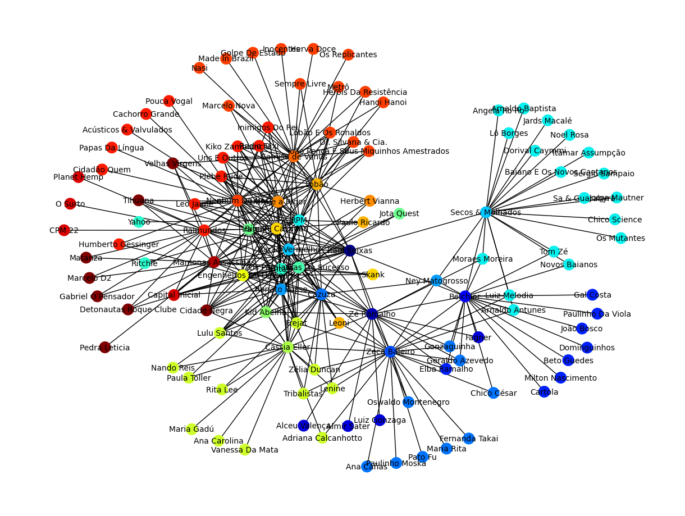
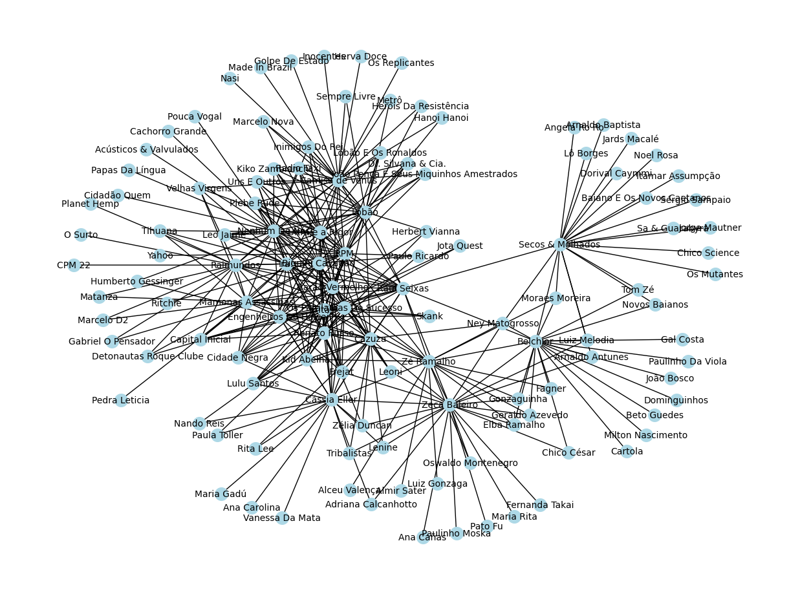
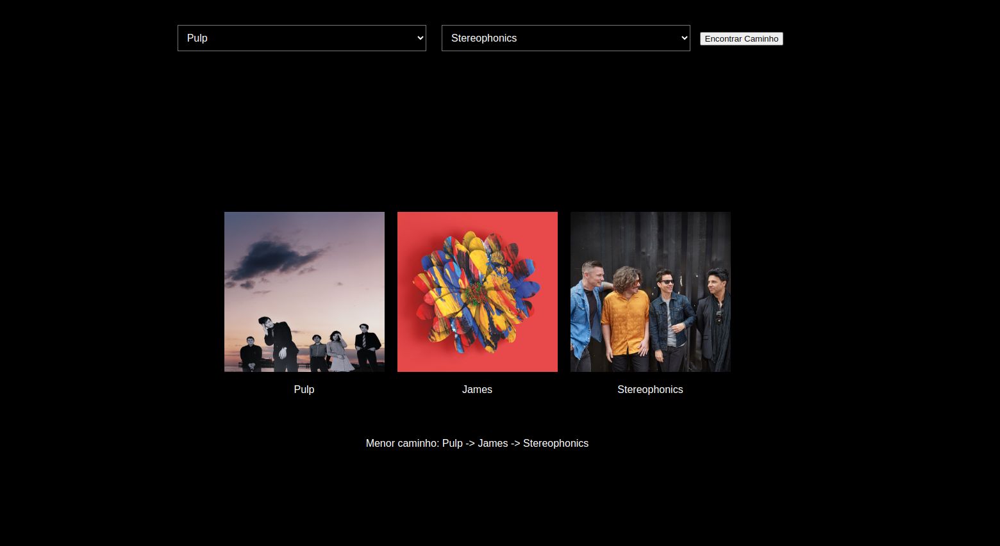
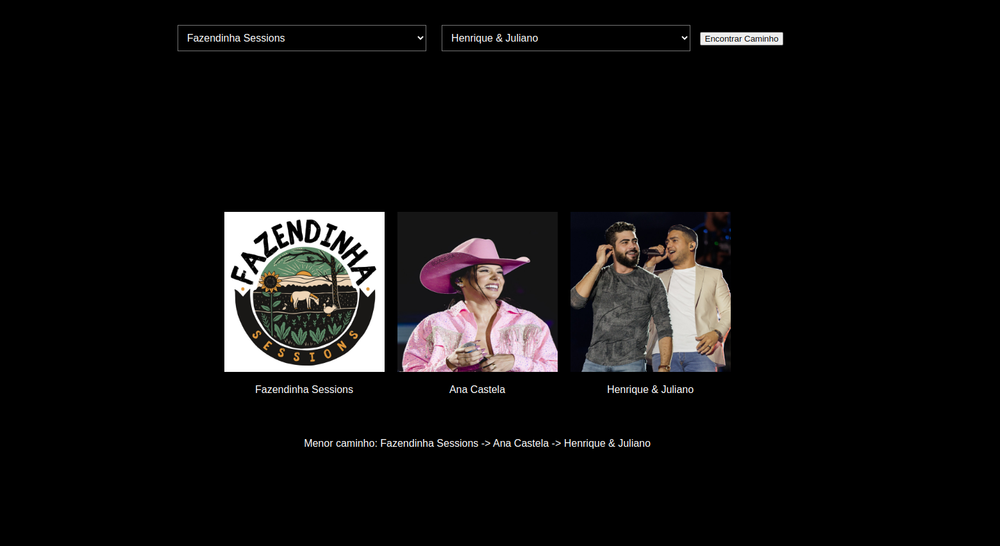
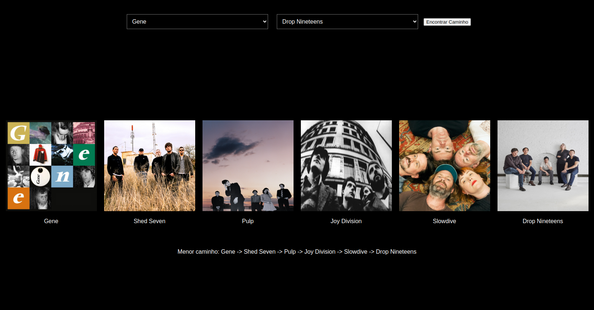

# Temas:
 - Grafos1
 


## Grafos Artistas do Spotify


## Alunos
|Matrícula | Aluno |
| -- | -- |
| 19/0048760  | Wellington Jonathan de Souza Rodrigues |
| 20/2063346  | José Filipi Brito Souza |


## Sobre 
Este trabalho visa utilizar grafos para explorar a conexão entre artistas no aplicativo spotify.

# Screenshots

## Exemplo de Grafos 

## grafo 01


## grafo 02


# Aplicação

## Imagem 1


## Imagem 2


## Imagem 3


# Vídeo da apresentação

## Apresentação 1

[Apresentação 1](./apresentacao.mp4)


## Instalação 
**Linguagem**: Python 3.x<br>
**Banco de dados**: Neo4j<br>

# Criação de um Grafo de Artistas Relacionados no Spotify

Este guia descreve como usar o código Python para criar um grafo de artistas relacionados no Spotify e visualizá-lo.

## Pré-requisitos

Certifique-se de ter as seguintes ferramentas e bibliotecas instaladas:

- Python 3.x (https://www.python.org/downloads/)
- Spotipy (biblioteca para acessar a API do Spotify) 
- NetworkX (biblioteca para criar e manipular grafos)
- Matplotlib (biblioteca para plotar o grafo) 
- Neo4j (banco de dados de grafos)
- Flask (framework de backend para python) & flask-cors
- Biblioteca de Neo4j para pyhon
- Biblioteca csv para python

```
pip install spotipy
pip install networkx
pip install matplotlib
pip install neo4j
pip install flask
pip install flask-cors

```
## Configuração

1. Crie um aplicativo no [Spotify Developer Dashboard](https://developer.spotify.com/documentation/web-api/concepts/apps).
2. Obtenha o seu `CLIENT_ID` e `CLIENT_SECRET` do aplicativo criado.
3. Substitua `'seu_client_id'` e `'seu_client_secret'` no [conf.json](./app/conf.json) pelos seus valores.

## Utilização dos códigos de BFS & DFS
1. Abra o arquivo grafo_spotify.ipynb no vscode. Utilize o jupyter-notebook no vscode acionando sua extensão.
2. Execute o código Python fornecido para criar o grafo de artistas relacionados. Certifique-se de definir o `artist_name` desejado e a profundidade (`depth`) da busca.
3. O grafo resultante será plotado e exibido na tela.
4. O grafo também será exportado em um arquivo JSON chamado "grafo_NomedoArtista.json" no diretório [GRAFO_SJON](./GRAFO_JSON).

## Utilização da aplicação
1. Abra o banco de dados Neo4j (Previamente populado com os dados dos csv's)
2. Inicie a API flask
3. Abra o arquivo [front.html](./app/front.html) em um navegador
4. Selecione dois artistas e pressione o botão

## Exemplo 

Aqui está um exemplo de código Python para criar um grafo de artistas relacionados a partir do artista "The Beatles" com profundidade 2:

```python
import spotipy
from spotipy.oauth2 import SpotifyOAuth
import networkx as nx
import json
import matplotlib.pyplot as plt

# Configurar as credenciais da API do Spotify
CLIENT_ID = 'seu_client_id'
CLIENT_SECRET = 'seu_client_secret'

# Resto do código...

# Exemplo de uso
artista_inicial = 'The Beatles'
grafo_artistas = criar_grafo_artistas_relacionados(artista_inicial, depth=2)
plotar_grafo(grafo_artistas)


``````


# Vídeo da apresentação


[Apresentação 1](./apresentacao.mp4)
